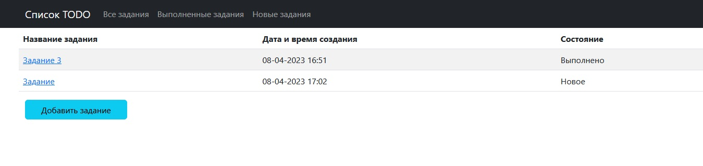
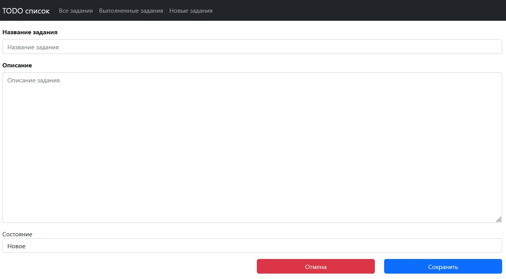
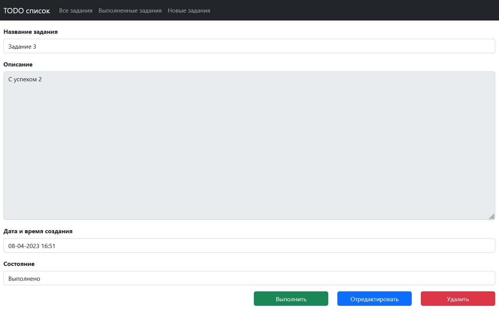
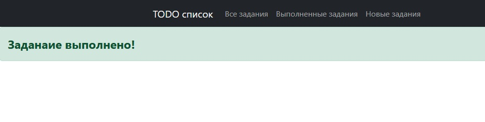
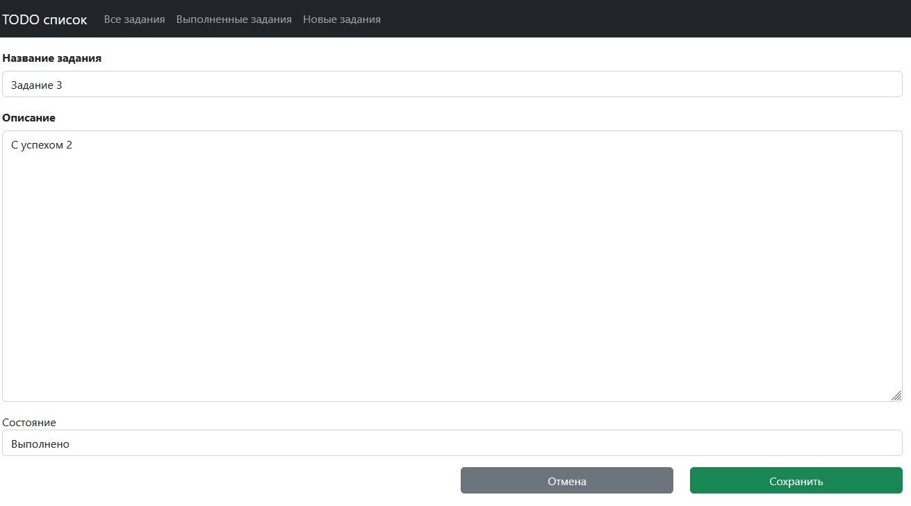

# TODO список

## О проекте:

Прикладное приложение для отслеживания процесса выполнения различных заданий. 
Представляет из себя набор таблиц в которых можно посмотреть все задания, выполненные и текущие.
В приложение имеется возможность добавления, редактирования и удаления заданий.

## Стек технологий:

    Spring boot 2.7.6
    Thymeleaf 3.0.15
    Bootstrap 4.3.1
    Hibernate 5.6.11.Final
    PostgreSql 42.2.9
    Liquibase 4.15
    Lombok 1.18.22
    Java 17

## Требования к окружению:

    Java 17
    Maven 3.8
    PostgreSql 14

## Запуск проекта:

- скачать проект
- создать базу данных: ```create database todo;```
- запусть Main class, расположение: ru.job4j.todo
- Открыть в браузере [ссылку](http://localhost:8080/)

## Взаимодействие с приложением:

#### На главной странице расположена таблица со всеми заданиями. На навигационной панели есть кнопки сортировки по состоянию задания.


#### При нажатии на кнопку "Добавить задание" происходит переход на страницу создания нового задания.


#### При нажатии на название задания в таблице происходит переход на страницу просмотра подробной информации задания.

- кнопка "Выполнить" меняет состояние задание на выполненное. После чего происходит переход на страницу с подтверждением выполнения.
  
- кнопка Отредактировать позволяет перейти на страницу редактирования задания.
- кнопка удалить - удаляет задание и возвращает на главную страницу.

#### На странице редактирования расположены расположены поля для редактирования, а также кнопки Отмена и Сохранить.

- кнопка Отмена производит переход на главную страницу.
- кнопка Сохранить изменят задание, после чего происходит переход на страницу с подтверждением редактирования.

## Telegram для связи с разработчиком:

@Stanislav_Bogatyrev
[ссылку](https://t.me/Stanislav_Bogatyrev)